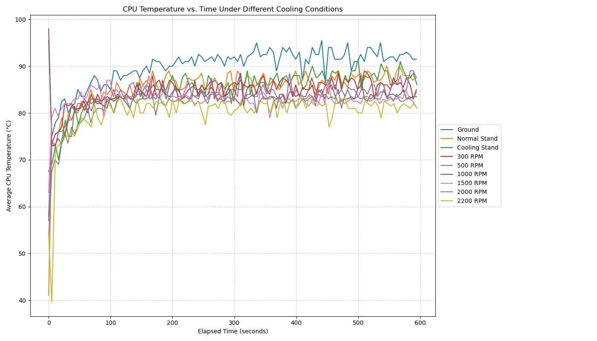
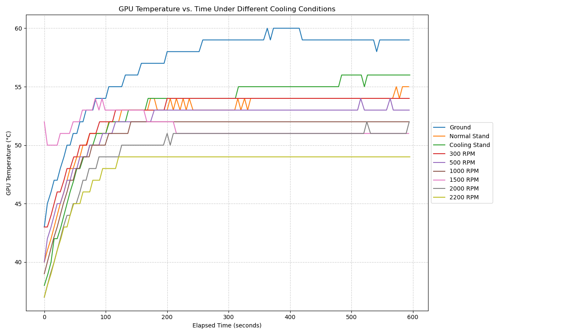
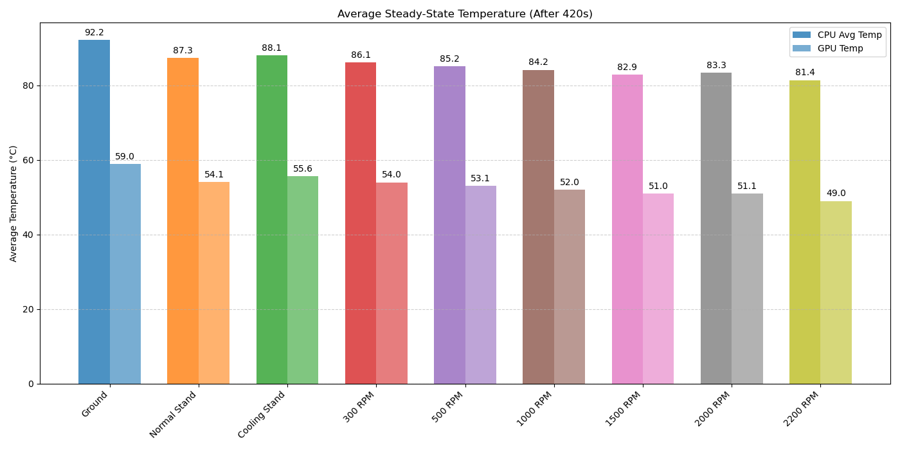
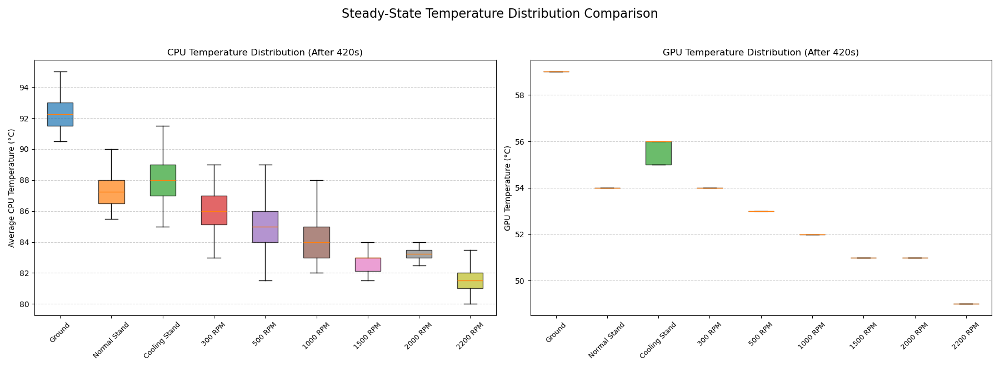
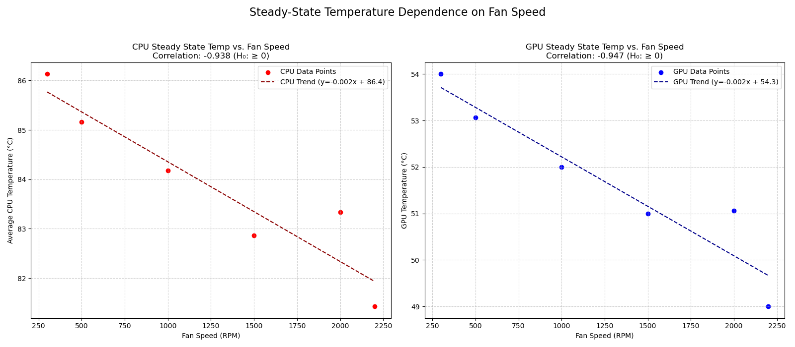

# Laptop Cooling Pad Performance Analysis: DELTA B3112GG on HP Victus 15

## Overview

This project aims to analyze the thermal performance of an HP Victus 15 laptop (specifically a model with 32GB RAM and an NVIDIA GeForce RTX 3050 4GB GPU) under load, comparing different cooling scenarios:

1.  **Baseline (Ground):** Laptop flat on the desk.
2.  **Baseline (Normal Stand):** Laptop elevated on a simple stand (no active cooling).
3.  **Baseline (Cooling Stand - Fans Off):** Laptop on the DELTA B3112GG cooling pad, but with the fans turned off.
4.  **Cooling Pad Tests:** Laptop on the DELTA B3112GG cooling pad with fans running at various speeds (e.g., 500 RPM, 1200 RPM).

The goal is to quantify the impact of the cooling pad and its fan speed on CPU and GPU temperatures during a sustained stress test.

## Hardware & Software Context

*   **Laptop:** HP Victus 15
    *   RAM: 32GB
    *   GPU: NVIDIA GeForce RTX 3050 (4GB VRAM)
*   **Cooling Pad:** DELTA B3112GG
*   **Operating System:** Linux (tests performed using Linux tools like `stress-ng`, `lm-sensors`, `nvidia-smi`)
*   **Analysis Language:** Python 3

## Methodology

1.  **Data Collection (`cooling_test.sh` - Example Script):**
    *   A bash script (`cooling_test.sh`, adapted for each test condition) is used to run a CPU stress test (`stress-ng`) for a defined duration (e.g., 600 seconds).
    *   Simultaneously, the script logs CPU temperatures (from `lm-sensors`) and GPU temperature (from `nvidia-smi` or `lm-sensors`) at regular intervals (e.g., every 5 seconds).
    *   Temperature data is appended to a CSV file specific to the test condition.
    *   **Important:** The provided bash script example needs modification or manual renaming of output files for different test runs (baselines, different RPMs). The example script currently hardcodes the output to `cooling_stand.csv`. You would need to run the script multiple times, adjusting the test setup (no pad, pad off, pad on with specific RPM) and saving the output to appropriately named CSV files (see Data Files section).

2.  **Data Analysis & Visualization (`cooling_data_graphs.v3.py`):**
    *   The Python script reads the generated CSV data files.
    *   It cleans the data, calculates the average CPU temperature (from two sensor readings if available), and determines elapsed time.
    *   It calculates steady-state average temperatures (temperatures after an initial warm-up period, configurable via `STEADY_STATE_START_TIME`).
    *   It generates several plots comparing the different test conditions:
        *   CPU Temperature vs. Time
        *   GPU Temperature vs. Time
        *   Box Plot comparison of steady-state temperature distributions.
        *   Bar chart of average steady-state temperatures.
        *   Scatter plot of steady-state temperature vs. Fan Speed (RPM), including a trendline and correlation coefficient.
    *   It performs a correlation analysis between fan speed (RPM) and steady-state temperatures to statistically evaluate the cooling pad's effectiveness (testing the hypothesis that higher speed leads to lower temperature).
    *   The script supports generating plots and log files in multiple languages (English 'en', Portuguese 'pt' configured).
    *   Outputs (plots and logs) are saved into a structured directory (`cooling_plots_multilang/`).

## Hypothesis Tested

The primary hypothesis tested by the scatter plot and correlation analysis is:

*   **Null Hypothesis (H₀):** Increasing fan speed does *not* decrease steady-state CPU/GPU temperature (correlation is ≥ 0).
*   **Alternative Hypothesis (H₁):** Increasing fan speed *decreases* steady-state CPU/GPU temperature (correlation is < 0).

## File Descriptions

*   `cooling_test.sh` (or similar): Bash script used for running stress tests and logging temperature data. *Needs adaptation/multiple runs for different test conditions.*
*   `cooling_data_graphs.v3.py`: Python script for processing data and generating plots/analysis.
*   `requirements.txt`: Lists the required Python libraries.
*   `*.csv`: Raw temperature data files. Expected names:
    *   `ground.csv`
    *   `normal_stand.csv`
    *   `cooling_stand.csv` (Fans Off)
    *   `cooling_test_NNNN.csv` or `cooling_Test_NNNN.csv` (where NNNN is the fan speed in RPM, e.g., `cooling_test_1200.csv`)
*   `cooling_plots_multilang/`: Main output directory created by the Python script.
    *   `en/`, `pt/` (etc.): Language-specific subdirectories.
        *   `*.png`: Plot image files.
        *   `results_en.txt`, `results_pt.txt`: Log files containing processing steps, warnings, steady-state means, and correlation analysis results for each language.

## Setup & Prerequisites

1.  **Linux Environment:** Required for the data collection script.
2.  **Bash Shell:** Required to run the data collection script.
3.  **System Tools:**
    *   `stress-ng`: For generating CPU load. Install using your package manager (e.g., `sudo apt install stress-ng`).
    *   `lm-sensors`: For reading CPU temperatures. Install (e.g., `sudo apt install lm-sensors`) and configure (`sudo sensors-detect`).
    *   `nvidia-smi`: For reading NVIDIA GPU temperature. Usually installed with the NVIDIA drivers.
4.  **Python 3:** Required for the analysis script.
5.  **Python Libraries:** Install using pip:
    ```bash
    pip install pandas matplotlib numpy scipy
    ```
    Alternatively, you can run these comand:  
    ```bash
    pip install -r requirements.txt
    ```

## Usage

1.  **Data Collection:**
    *   Modify the `cooling_test.sh` script or your data collection method as needed for your specific hardware (`sensors` output paths, `nvidia-smi` availability).
    *   Run the stress test and data logging for each condition:
        *   Run for 'Ground' baseline, save output as `ground.csv`.
        *   Run for 'Normal Stand' baseline, save output as `normal_stand.csv`.
        *   Run for 'Cooling Stand (Fans Off)' baseline, save output as `cooling_stand.csv`.
        *   For each desired fan RPM (e.g., 1200 RPM):
            *   Set the cooling pad to that speed.
            *   Run the test, save output as `cooling_test_1200.csv` (or `cooling_Test_1200.csv`).
    *   Ensure all resulting `.csv` files are placed in the same directory as the Python script, or update `DATA_DIR` in the script.

2.  **Data Analysis:**
    *   Navigate to the directory containing `cooling_data_graphs.v3.py` and the `.csv` data files in your terminal.
    *   Run the Python script:
        ```bash
        python cooling_data_graphs.v3.py
        ```
    *   The script will process the files, print status messages and analysis results to the console, and save plots and detailed logs to the `cooling_plots_multilang/` directory (creating it if necessary).

## Data File Format

The CSV files must contain the following columns, in this order, with a header row:

`Timestamp,CPU_Temp,CPU_Temp2,GPU_Temp`

*   **Timestamp:** Date and time of the reading (e.g., `YYYY-MM-DD HH:MM:SS`).
*   **CPU_Temp:** Primary CPU package temperature (°C).
*   **CPU_Temp2:** Secondary CPU temperature reading (e.g., Core 0) (°C). The Python script averages `CPU_Temp` and `CPU_Temp2`.
*   **GPU_Temp:** GPU temperature (°C).

Values should be numeric. Non-numeric values or missing readings will be handled (logged and potentially dropped) by the Python script.

## Output Interpretation

*   **Time Series Plots:** Show temperature trends over the duration of the test for each condition. Lower lines indicate better cooling.
*   **Box Plots:** Visualize the distribution (median, quartiles, range) of temperatures during the steady-state period. Lower boxes indicate lower average temperatures and potentially less variability.
*   **Bar Chart:** Provides a clear comparison of the average steady-state temperatures across all conditions.
*   **Scatter Plot:** Shows the relationship between fan speed (RPM) and steady-state temperature. A downward-sloping trendline with a negative correlation coefficient supports the hypothesis that the fan speed helps reduce temperatures.
*   **Log Files (`results_*.txt`):** Contain detailed information about file processing, calculated means, warnings, and the final correlation analysis results, which explicitly state whether the data supports rejecting the null hypothesis.

## Customization

*   **Python Script (`cooling_data_graphs.v3.py`):**
    *   `DATA_DIR`: Change if CSV files are not in the script's directory.
    *   `BASELINE_FILES`: Modify keys/filenames if your baseline conditions or filenames differ. The order here dictates the order in plots.
    *   `TEST_FILE_PATTERN`: Adjust the pattern if your test file naming convention changes.
    *   `BASE_OUTPUT_DIR`: Change the location for saved plots and logs.
    *   `STEADY_STATE_START_TIME`: Adjust based on how long your system takes to reach stable temperatures under load (in seconds).
    *   `LANGUAGES`: Add/remove language codes (requires adding corresponding translations to the `translations` dictionary).
    *   `translations`: Add/modify text for different languages or customize existing messages.
*   **Bash Script (`cooling_test.sh`):**
    *   `STRESS_TIME`, `INTERVAL`: Modify test duration and sampling frequency.
    *   `CSV_FILE`: **Crucially, modify this or the script's logic to save different filenames for different tests.**
    *   `sensors` / `nvidia-smi` commands: Adapt the `awk`, `grep`, `sed` commands if the output format of these tools differs on your system or for your specific hardware components.


      
## Results and Analysis

This section presents the key findings from the thermal tests comparing the different cooling scenarios for the HP Victus 15.

### Temperature Over Time

**CPU Temperature vs. Time:**


*Description: This plot shows the average CPU temperature progression over the 600-second stress test for each condition. We can observe the initial temperature spike and the gradual stabilization towards a steady state.*

**GPU Temperature vs. Time:**


*Description: Similar to the CPU plot, this shows the GPU temperature trend over the test duration. Note the distinct temperature curves for each cooling setup.*

### Steady-State Temperature Comparison

**Average Steady-State Temperatures:**


*Description: This bar chart compares the average CPU and GPU temperatures calculated *after* the system reached a steady state (post 420 seconds). It provides a clear comparison of the effectiveness of each cooling method during sustained load. Lower bars indicate better cooling performance.*

**Steady-State Temperature Distribution:**


*Description: These box plots visualize the distribution (median, quartiles, range excluding outliers) of CPU and GPU temperatures during the steady-state period (after 420 seconds). They offer insight into both the average temperature and the temperature stability for each condition.*

### Temperature Dependence on Fan Speed

**Steady-State Temperature vs. Fan Speed:**


*Description: These scatter plots directly visualize the relationship between the cooling pad's fan speed (RPM) and the resulting steady-state CPU and GPU temperatures. The dashed lines represent the linear trend, and the equations quantify this relationship. The correlation coefficient (included in the title) measures the strength and direction of this linear relationship.*

### Correlation Analysis (RPM vs. Steady State Temperature)

The statistical analysis confirms the visual trend observed in the scatter plots:

    

IGNORE_WHEN_COPYING_START
Use code with caution. Markdown
IGNORE_WHEN_COPYING_END
--- Correlation Analysis (RPM vs Steady State Temp) ---
CPU: Pearson Correlation Coefficient = -0.938
GPU: Pearson Correlation Coefficient = -0.947
Strong negative correlation found for CPU, supporting the alternative hypothesis (H₁).
Strong negative correlation found for GPU, supporting the alternative hypothesis (H₁).

      
**Interpretation:**

*   Both CPU and GPU temperatures show a **strong negative correlation** with the cooling pad's fan speed (correlation coefficients close to -1.0).
*   This provides strong statistical evidence **supporting the alternative hypothesis (H₁)**: Increasing the fan speed of the DELTA B3112GG cooling pad significantly decreases the steady-state CPU and GPU temperatures of the HP Victus 15 under load.

    