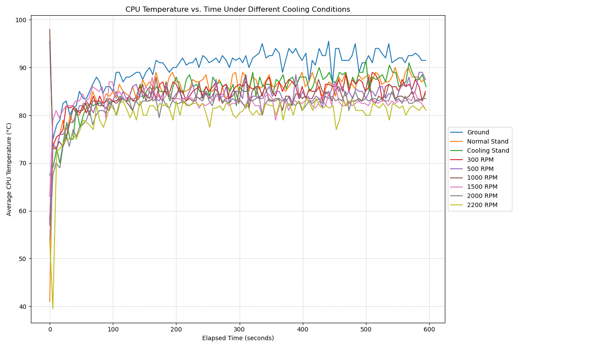
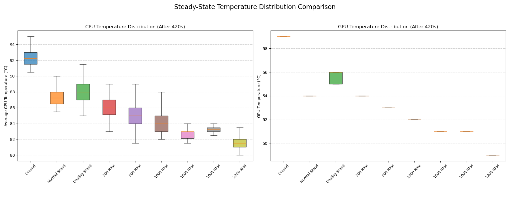
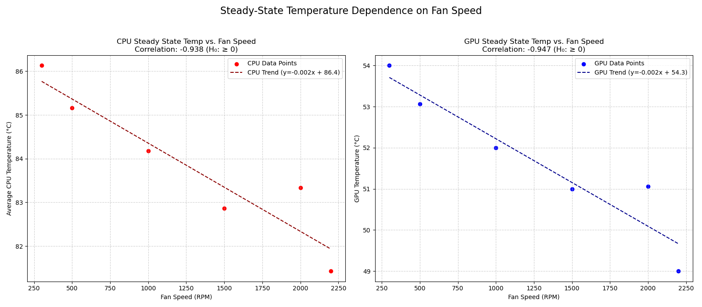

      
# Análise de Desempenho da Base cOOLER: DELTA B3112GG no HP Victus 15

## Visão Geral

Este projeto visa analisar o desempenho térmico de um laptop HP Victus 15 (especificamente um modelo com 32GB de RAM e uma GPU NVIDIA GeForce RTX 3050 4GB) sob carga, comparando diferentes cenários de refrigeração:

1.  **Referência (Mesa):** Laptop diretamente sobre a mesa.
2.  **Referência (Suporte Normal):** Laptop elevado em um suporte simples (sem refrigeração ativa).
3.  **Referência (Base Cooler - Ventoinhas Desligadas):** Laptop sobre a base cooler DELTA B3112GG, mas com as ventoinhas desligadas.
4.  **Testes com Base Cooler:** Laptop sobre a base cooler DELTA B3112GG com as ventoinhas operando em várias velocidades (ex: 300 RPM, 500 RPM, 1000 RPM, 1500 RPM, 2000 RPM, 2200 RPM).

O objetivo é quantificar o impacto da base cooler e da velocidade de suas ventoinhas nas temperaturas da CPU e GPU durante um teste de estresse sustentado.

## Contexto de Hardware & Software

*   **Laptop:** HP Victus 15
    *   RAM: 32GB
    *   GPU: NVIDIA GeForce RTX 3050 (4GB VRAM)
*   **Base Cooler:** DELTA B3112GG
*   **Sistema Operacional:** Linux (testes realizados usando ferramentas Linux como `stress-ng`, `lm-sensors`, `nvidia-smi`)
*   **Linguagem de Análise:** Python 3

## Metodologia

1.  **Coleta de Dados (`cooling_test.sh` - Script Exemplo):**
    *   Um script bash (`cooling_test.sh`, adaptado para cada condição de teste) é usado para executar um teste de estresse de CPU (`stress-ng`) por uma duração definida (ex: 600 segundos).
    *   Simultaneamente, o script registra as temperaturas da CPU (do `lm-sensors`) e a temperatura da GPU (do `nvidia-smi` ou `lm-sensors`) em intervalos regulares (ex: a cada 5 segundos).
    *   Os dados de temperatura são anexados a um arquivo CSV específico para a condição de teste.
    *   **Importante:** O script bash de exemplo fornecido precisa de modificação ou renomeação manual dos arquivos de saída para diferentes execuções de teste (referências, RPMs diferentes). Você precisaria executar o script várias vezes, ajustando a configuração do teste (sem base, base desligada, base ligada com RPM específico) e salvando a saída em arquivos CSV nomeados apropriadamente (veja a seção Descrição dos Arquivos).

2.  **Análise e Visualização de Dados (`cooling_data_graphs.v3.py`):**
    *   O script Python lê os arquivos de dados CSV gerados.
    *   Ele limpa os dados, calcula a temperatura média da CPU (a partir de duas leituras de sensor, se disponíveis) e determina o tempo decorrido.
    *   Ele calcula as temperaturas médias em estado estacionário (temperaturas após um período inicial de aquecimento, configurável via `STEADY_STATE_START_TIME`).
    *   Ele gera vários gráficos comparando as diferentes condições de teste:
        *   Temperatura da CPU vs. Tempo
        *   Temperatura da GPU vs. Tempo
        *   Comparação em Box Plot das distribuições de temperatura em estado estacionário.
        *   Gráfico de barras das temperaturas médias em estado estacionário.
        *   Gráfico de dispersão da temperatura em estado estacionário vs. Velocidade da Ventoinha (RPM), incluindo uma linha de tendência e coeficiente de correlação.
    *   Ele realiza uma análise de correlação entre a velocidade da ventoinha (RPM) e as temperaturas em estado estacionário para avaliar estatisticamente a eficácia da base cooler (testando a hipótese de que maior velocidade leva a menor temperatura).
    *   O script suporta a geração de gráficos e arquivos de log em múltiplos idiomas (Inglês 'en', Português 'pt' configurados).
    *   As saídas (gráficos e logs) são salvas em um diretório estruturado (`cooling_plots_multilang/`).

## Hipótese Testada

A hipótese primária testada pelo gráfico de dispersão e pela análise de correlação é:

*   **Hipótese Nula (H₀):** Aumentar a velocidade da ventoinha *não* diminui a temperatura de estado estacionário da CPU/GPU (correlação ≥ 0).
*   **Hipótese Alternativa (H₁):** Aumentar a velocidade da ventoinha *diminui* a temperatura de estado estacionário da CPU/GPU (correlação < 0).

## Descrição dos Arquivos

*   `cooling_test.sh` (ou similar): Script Bash usado para executar testes de estresse e registrar dados de temperatura. *Necessita adaptação/múltiplas execuções para diferentes condições de teste.*
*   `cooling_data_graphs.v3.py`: Script Python para processar dados e gerar gráficos/análise.
*   `requirements.txt`: Lista as bibliotecas Python necessárias.
*   `*.csv`: Arquivos de dados brutos de temperatura. Nomes esperados:
    *   `ground.csv` (Mesa)
    *   `normal_stand.csv` (Suporte Normal)
    *   `cooling_stand.csv` (Base Cooler - Ventoinhas Desligadas)
    *   `cooling_test_NNNN.csv` ou `cooling_Test_NNNN.csv` (onde NNNN é a velocidade da ventoinha em RPM, ex: `cooling_test_1200.csv`)
*   `cooling_plots_multilang/`: Diretório principal de saída criado pelo script Python.
    *   `en/`, `pt/` (etc.): Subdiretórios específicos do idioma.
        *   `*.png`: Arquivos de imagem dos gráficos.
        *   `results_en.txt`, `results_pt.txt`: Arquivos de log contendo etapas de processamento, avisos, médias de estado estacionário e resultados da análise de correlação para cada idioma.

## Configuração & Pré-requisitos

1.  **Ambiente Linux:** Necessário para o script de coleta de dados.
2.  **Shell Bash:** Necessário para executar o script de coleta de dados.
3.  **Ferramentas de Sistema:**
    *   `stress-ng`: Para gerar carga na CPU. Instale usando seu gerenciador de pacotes (ex: `sudo apt install stress-ng`).
    *   `lm-sensors`: Para ler as temperaturas da CPU. Instale (ex: `sudo apt install lm-sensors`) e configure (`sudo sensors-detect`).
    *   `nvidia-smi`: Para ler a temperatura da GPU NVIDIA. Geralmente instalado com os drivers NVIDIA.
4.  **Python 3:** Necessário para o script de análise.
5.  **Bibliotecas Python:** Instale usando pip:
    ```bash
    pip install pandas matplotlib numpy scipy
    ```
    Alternativamente, você pode executar este comando:
    ```bash
    pip install -r requirements.txt
    ```

## Uso

1.  **Coleta de Dados:**
    *   Modifique o script `cooling_test.sh` ou seu método de coleta de dados conforme necessário para seu hardware específico (caminhos de saída do `sensors`, disponibilidade do `nvidia-smi`).
    *   Execute o teste de estresse e o registro de dados para cada condição:
        *   Execute para a referência 'Mesa', salve a saída como `ground.csv`.
        *   Execute para a referência 'Suporte Normal', salve a saída como `normal_stand.csv`.
        *   Execute para a referência 'Base Cooler (Ventoinhas Desligadas)', salve a saída como `cooling_stand.csv`.
        *   Para cada RPM de ventoinha desejado (ex: 1200 RPM):
            *   Ajuste a base cooler para essa velocidade.
            *   Execute o teste, salve a saída como `cooling_test_1200.csv` (ou `cooling_Test_1200.csv`).
    *   Certifique-se de que todos os arquivos `.csv` resultantes sejam colocados no mesmo diretório do script Python, ou atualize `DATA_DIR` no script.

2.  **Análise de Dados:**
    *   Navegue até o diretório que contém `cooling_data_graphs.v3.py` e os arquivos de dados `.csv` no seu terminal.
    *   Execute o script Python:
        ```bash
        python cooling_data_graphs.v3.py
        ```
    *   O script processará os arquivos, imprimirá mensagens de status e resultados da análise no console, e salvará gráficos e logs detalhados no diretório `cooling_plots_multilang/` (criando-o se necessário).

## Formato do Arquivo de Dados

Os arquivos CSV devem conter as seguintes colunas, nesta ordem, com uma linha de cabeçalho:

`Timestamp,CPU_Temp,CPU_Temp2,GPU_Temp`

*   **Timestamp:** Data e hora da leitura (ex: `YYYY-MM-DD HH:MM:SS`).
*   **CPU_Temp:** Temperatura primária do encapsulamento da CPU (°C).
*   **CPU_Temp2:** Leitura secundária de temperatura da CPU (ex: Core 0) (°C). O script Python calcula a média de `CPU_Temp` e `CPU_Temp2`.
*   **GPU_Temp:** Temperatura da GPU (°C).

Os valores devem ser numéricos. Valores não numéricos ou leituras ausentes serão tratados (registrados em log e potencialmente descartados) pelo script Python.

## Interpretação dos Resultados

*   **Gráficos de Séries Temporais:** Mostram as tendências de temperatura ao longo da duração do teste para cada condição. Linhas mais baixas indicam melhor refrigeração.
*   **Box Plots:** Visualizam a distribuição (mediana, quartis, intervalo) das temperaturas durante o período de estado estacionário. Caixas mais baixas indicam temperaturas médias menores e potencialmente menos variabilidade.
*   **Gráfico de Barras:** Fornece uma comparação clara das temperaturas médias em estado estacionário entre todas as condições.
*   **Gráfico de Dispersão:** Mostra a relação entre a velocidade da ventoinha (RPM) e a temperatura em estado estacionário. Uma linha de tendência descendente com um coeficiente de correlação negativo apoia a hipótese de que a velocidade da ventoinha ajuda a reduzir as temperaturas.
*   **Arquivos de Log (`results_*.txt`):** Contêm informações detalhadas sobre o processamento dos arquivos, médias calculadas, avisos e os resultados finais da análise de correlação, que declaram explicitamente se os dados suportam a rejeição da hipótese nula.

## Customização

*   **Script Python (`cooling_data_graphs.v3.py`):**
    *   `DATA_DIR`: Mude se os arquivos CSV não estiverem no diretório do script.
    *   `BASELINE_FILES`: Modifique chaves/nomes de arquivo se suas condições de referência ou nomes de arquivo diferirem. A ordem aqui dita a ordem nos gráficos.
    *   `TEST_FILE_PATTERN`: Ajuste o padrão se sua convenção de nomenclatura de arquivos de teste mudar.
    *   `BASE_OUTPUT_DIR`: Mude o local para salvar gráficos e logs.
    *   `STEADY_STATE_START_TIME`: Ajuste com base em quanto tempo seu sistema leva para atingir temperaturas estáveis sob carga (em segundos).
    *   `LANGUAGES`: Adicione/remova códigos de idioma (requer adicionar as traduções correspondentes ao dicionário `translations`).
    *   `translations`: Adicione/modifique texto para diferentes idiomas ou personalize mensagens existentes.
*   **Script Bash (`cooling_test.sh`):**
    *   `STRESS_TIME`, `INTERVAL`: Modifique a duração do teste e a frequência de amostragem.
    *   `CSV_FILE`: **Crucialmente, modifique este ou a lógica do script para salvar nomes de arquivos diferentes para testes diferentes.**
    *   Comandos `sensors` / `nvidia-smi`: Adapte os comandos `awk`, `grep`, `sed` se o formato de saída dessas ferramentas diferir no seu sistema ou para seus componentes de hardware específicos.

## Resultados e Análise

Esta seção apresenta as principais descobertas dos testes térmicos comparando os diferentes cenários de refrigeração para o HP Victus 15.

### Temperatura ao Longo do Tempo

**Temperatura da CPU vs. Tempo:**


*Descrição: Este gráfico mostra a progressão da temperatura média da CPU ao longo do teste de estresse de 600 segundos para cada condição. Podemos observar o pico inicial de temperatura e a estabilização gradual em direção a um estado estacionário.*

**Temperatura da GPU vs. Tempo:**


*Descrição: Semelhante ao gráfico da CPU, este mostra a tendência da temperatura da GPU durante o teste. Note as curvas de temperatura distintas para cada configuração de refrigeração.*

### Comparação da Temperatura em Estado Estacionário

**Temperaturas Médias em Estado Estacionário:**


*Descrição: Este gráfico de barras compara as temperaturas médias da CPU e GPU calculadas *após* o sistema atingir um estado estacionário (após 420 segundos). Ele fornece uma comparação clara da eficácia de cada método de refrigeração durante carga sustentada. Barras mais baixas indicam melhor desempenho de refrigeração.*

**Distribuição da Temperatura em Estado Estacionário:**


*Descrição: Estes box plots visualizam a distribuição (mediana, quartis, intervalo excluindo outliers) das temperaturas da CPU e GPU durante o período de estado estacionário (após 420 segundos). Eles oferecem uma visão tanto da temperatura média quanto da estabilidade da temperatura para cada condição.*

### Dependência da Temperatura na Velocidade da Ventoinha

**Temperatura em Estado Estacionário vs. Velocidade da Ventoinha:**


*Descrição: Estes gráficos de dispersão visualizam diretamente a relação entre a velocidade da ventoinha da base cooler (RPM) e as temperaturas resultantes de estado estacionário da CPU e GPU. As linhas tracejadas representam a tendência linear, e as equações quantificam essa relação. O coeficiente de correlação (incluído no título) mede a força e a direção dessa relação linear.*

### Análise de Correlação (RPM vs. Temperatura em Estado Estacionário)

A análise estatística confirma a tendência visual observada nos gráficos de dispersão:

--- Análise de Correlação (RPM vs Temp Estacionária) ---

CPU: Coeficiente de Correlação Pearson = -0.938

GPU: Coeficiente de Correlação Pearson = -0.947

Forte correlação negativa encontrada para CPU, apoiando a hipótese alternativa (H₁).

Forte correlação negativa encontrada para GPU, apoiando a hipótese alternativa (H₁).

------
      
**Interpretação:**

*   Tanto as temperaturas da CPU quanto da GPU mostram uma **forte correlação negativa** com a velocidade da ventoinha da base cooler (coeficientes de correlação próximos de -1.0).
*   Isso fornece forte evidência estatística **apoiando a hipótese alternativa (H₁)**: Aumentar a velocidade da ventoinha da base cooler DELTA B3112GG diminui significativamente as temperaturas de estado estacionário da CPU e GPU do HP Victus 15 sob carga.

    